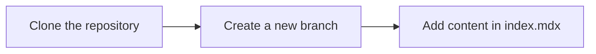

# 1. Submitting a Blog Post

1. **Clone the repository** to your local machine.
2. **Create a new branch** using the format `{date}-{title}`.  
   Example: `2021-01-01-hello-world` for a post titled "Hello, World!" on `2021-01-01`.
3. **Add your content**:
   - Navigate to `content/{slug}`.
   - Create a new `index.mdx` file.
   - Write your blog post using MarkdownX.



# 2. Blog Post Template

```markdown
---
title: 
description: 
image: 
publishedAt: 
updatedAt: 
author: 
isPublished: 
tags: 
---
...Content goes here...
```

# 3. Managing Assets

Store images, videos, and other assets in `public`. Reference them using relative paths from `public`.  
Example: For `public/images/{slug}/my-image.jpg`, reference it as `../../public/images/{slug}/my-image.jpg`.

## 3.1 Adding Images in MDX

```markdown
<Image
  src="/images/{slug}/my-image.jpg"
  width="718"
  height="404"
  alt="Description"
  sizes="100vw"
/>
```

# 4. Frontmatter Fields

- **`title`**: Blog post title (required).
- **`description`**: Brief summary (required).
- **`image`**: Thumbnail/header image path (required).
- **`publishedAt`**: Publish date (YYYY-MM-DD) (required).
- **`updatedAt`**: Last update date (YYYY-MM-DD) (required).
- **`author`**: Author name (required).
- **`isPublished`**: Set to `true` to publish, `false` for draft (required).
- **`tags`**: Categorization tags (required).
